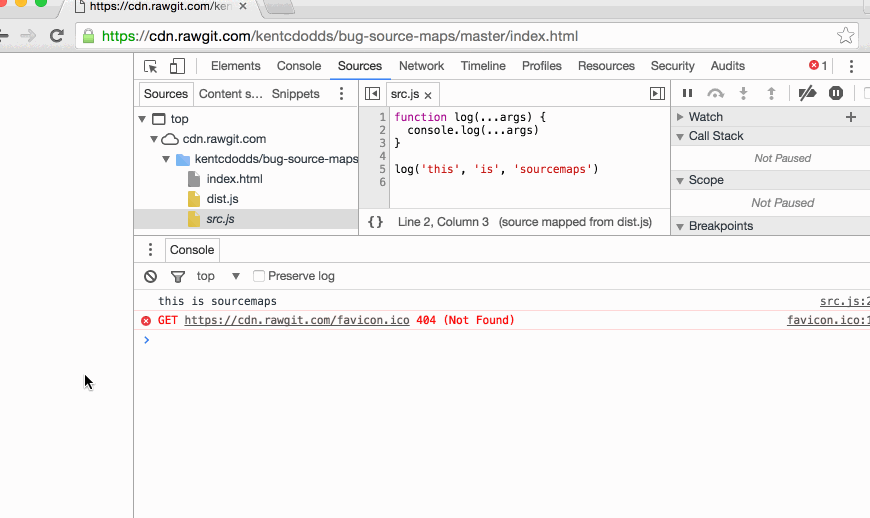

# bug-source-maps

This is to help reproduce [this Chrome bug](https://bugs.chromium.org/p/chromium/issues/detail?id=598032)

## FIXED

This appears to have been [fixed](https://bugs.chromium.org/p/chromium/issues/detail?id=598032#c3) in Chrome Canary!



## To Reproduce:


You don't have to clone this repo, you can view it online [here](https://cdn.rawgit.com/kentcdodds/bug-source-maps/master/index.html)

## Rebuild the dist:

```
node_modules/.bin/babel src.js --presets es2015 --source-maps true --out-file dist.js
```

