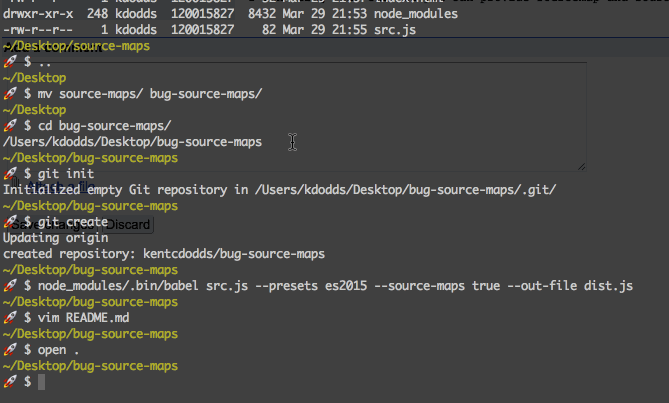

# bug-source-maps

This is to help reproduce [this Chrome bug](https://bugs.chromium.org/p/chromium/issues/detail?id=598032)

## To Reproduce:



## Rebuild the dist:

```
node_modules/.bin/babel src.js --presets es2015 --source-maps true --out-file dist.js
```

